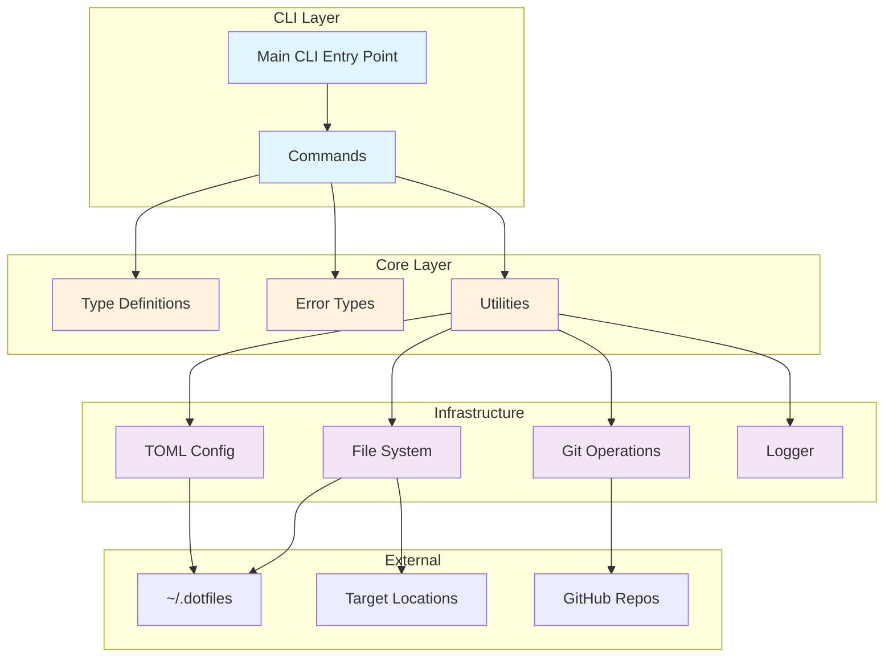
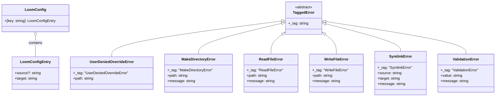
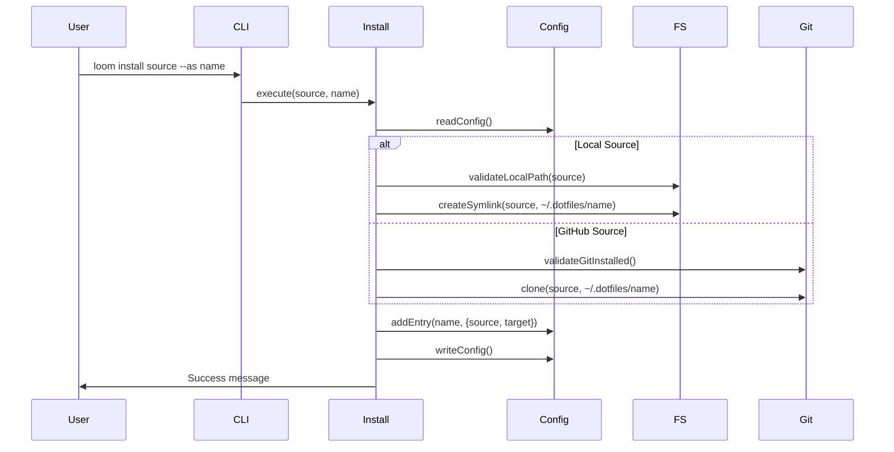
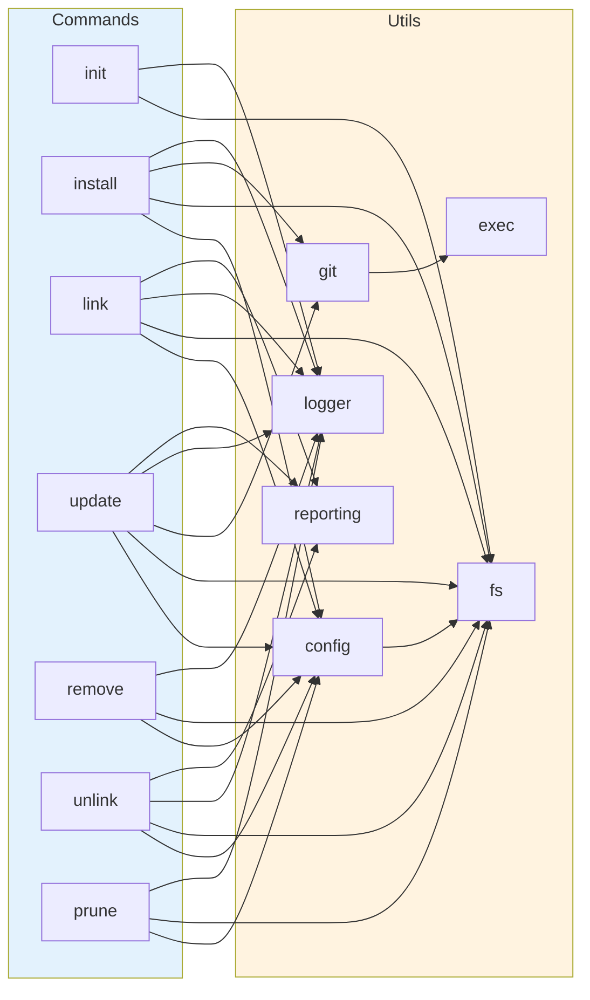

# Loom Repository Analysis

## 1. Repository Overview

**Loom** is a modern, flexible dotfiles manager built with TypeScript and the Effect ecosystem. It provides a clean, functional approach to managing development environment configurations through a centralized `~/.dotfiles` directory.

### Project Purpose
- Simplify dotfile management across multiple machines
- Provide a declarative TOML-based configuration
- Support both local and Git-based dotfile sources
- Offer interactive CLI for common operations

### Technologies Used
- **Language**: TypeScript (ES modules)
- **Runtime**: Node.js
- **Core Framework**: Effect (functional programming library)
- **CLI Framework**: @effect/cli
- **Configuration**: TOML via @iarna/toml
- **Testing**: Vitest with @effect/vitest
- **Package Manager**: pnpm

### Key Dependencies
- `effect: ^3.17.1` - Core functional programming library
- `@effect/cli: ^0.69.0` - CLI framework built on Effect
- `@effect/platform-node: ^0.94.0` - Node.js platform integration
- `@iarna/toml: ^2.2.5` - TOML parser/writer

### Target Users
- Developers managing dotfiles across multiple machines
- Teams standardizing development environments
- Users seeking a modern alternative to traditional dotfile managers

## 2. Project Structure Analysis

```
loom/
├── src/
│   ├── main.ts              # Application entry point
│   ├── commands/            # CLI command implementations
│   │   ├── init.ts         # Initialize loom setup
│   │   ├── install.ts      # Install new dotfiles
│   │   ├── link.ts         # Create symlinks
│   │   ├── prune.ts        # Clean unmanaged dotfiles
│   │   ├── remove.ts       # Remove dotfile entries
│   │   ├── unlink.ts       # Remove symlinks
│   │   └── update.ts       # Update Git-managed dotfiles
│   ├── errors/
│   │   └── index.ts        # Custom error types
│   ├── types/
│   │   └── index.ts        # Type definitions and schemas
│   └── utils/
│       ├── config.ts       # TOML config management
│       ├── exec.ts         # Command execution
│       ├── fs.ts           # File system operations
│       ├── git.ts          # Git integration
│       ├── logger.ts       # Custom logging
│       └── reporting.ts    # Operation reporting
├── package.json            # Node.js package config
├── tsconfig.json          # TypeScript configuration
├── vitest.config.ts       # Test configuration
├── README.md              # Project documentation
└── LICENSE                # MIT License
```

### Configuration Files
- **package.json**: Defines project metadata, scripts, and dependencies
- **tsconfig.json**: Strict TypeScript configuration with ESNext target
- **vitest.config.ts**: Test runner configuration for Node.js environment
- **pnpm-lock.yaml**: Lockfile for reproducible installs

### Entry Points
- Main executable: `src/main.ts`
- Command pattern: Each command in `src/commands/` exports an execute function

## 3. High-Level Architecture Diagram



### Architectural Patterns
- **Functional Core**: Pure functions with Effect for side effects
- **Command Pattern**: Each CLI command is a separate module
- **Error as Values**: Typed errors using Effect's TaggedError
- **Dependency Injection**: Effect's layer system for dependencies

## 4. Module/Component Analysis

### Commands Module (`src/commands/`)
**Responsibility**: Implement CLI command logic
- **Public Interface**: Each command exports a Command type from @effect/cli
- **Dependencies**: Utils, Types, Errors modules
- **Design Patterns**: Command pattern with Effect-based execution

### Utils Module (`src/utils/`)
**Responsibility**: Provide reusable functionality
- **Components**:
  - `config.ts`: TOML file I/O with conflict resolution
  - `fs.ts`: Safe file system operations with path constants
  - `git.ts`: Git command validation and execution
  - `exec.ts`: Promisified command execution
  - `logger.ts`: Colored terminal output
  - `reporting.ts`: Operation count tracking

### Errors Module (`src/errors/`)
**Responsibility**: Define typed error cases
- **Design**: Schema.TaggedError for runtime type safety
- **Error Types**: File I/O, validation, user actions, command execution

### Types Module (`src/types/`)
**Responsibility**: Define data models
- **Models**: LoomConfig, LoomConfigEntry
- **Validation**: Runtime validation using Effect Schema

## 5. Class/Interface Hierarchy



## 6. Data Flow and Sequence Diagrams

### Install Command Flow


### Link Command Flow
```mermaid
sequenceDiagram
    participant User
    participant CLI
    participant Link
    participant Config
    participant FS
    
    User->>CLI: loom link
    CLI->>Link: execute()
    Link->>Config: readConfig()
    
    loop For each config entry
        Link->>FS: checkSymlinkExists(target)
        alt Symlink exists
            Link->>FS: unlink(target)
        end
        Link->>FS: createSymlink(~/.dotfiles/entry, target)
    end
    
    Link->>User: Report results (woven/skipped/failed)
```

## 7. Module Interaction Map



## 8. Database/Storage Schema

### TOML Configuration Format
Location: `~/.dotfiles/loom.toml`

```toml
# Entry format
[entry_name]
source = "username/repo"  # Optional: GitHub source or local path
target = "~/.config/app"  # Required: Where to create symlink

# Example entries
[nvim]
source = "craftzdog/dotfiles-public"
target = "~/.config/nvim"

[tmux]
target = "~/.tmux.conf"
```

### File System Structure
```
~/.dotfiles/
├── loom.toml           # Configuration file
├── nvim/               # Cloned/linked dotfiles
├── tmux/
└── ...
```

## 9. API Documentation

### CLI Commands

#### `loom init`
Initialize a new loom setup
- Creates `~/.dotfiles` directory
- Creates empty `loom.toml` config

#### `loom install <source> [--as <name>]`
Install a new dotfile configuration
- **source**: Local path or GitHub repo (username/repo)
- **--as**: Custom name for the entry
- Clones Git repos or creates symlinks for local sources

#### `loom link`
Create symlinks from dotfiles to targets
- Reads all entries from config
- Creates symlinks to specified targets
- Reports success/failure counts

#### `loom update`
Update Git-managed dotfiles
- Runs `git pull` on entries with source
- Reports update status

#### `loom remove <name>`
Remove a dotfile entry
- Removes from config
- Deletes from `~/.dotfiles`

#### `loom unlink`
Remove created symlinks
- Removes symlinks at target locations
- Keeps dotfiles intact

#### `loom prune`
Clean unmanaged dotfiles
- Interactive cleanup
- Options: Remove, Keep, or Weave (add to config)

## 10. Key Algorithms and Business Logic

### Conflict Resolution (config.ts)
```typescript
// When adding entries that already exist
1. Check if entry exists in config
2. If exists, prompt user: Override or Cancel
3. Handle user choice with appropriate action
```

### Path Traversal Protection (fs.ts)
```typescript
// Prevent directory traversal attacks
1. Resolve dotfile path to absolute
2. Check if path starts with DOTFILES_ROOT
3. Reject if path escapes dotfiles directory
```

### Operation Reporting Pattern
```typescript
// Generic reporter for tracking operations
1. Initialize counters for success/skip/fail
2. Execute operations with error handling
3. Increment appropriate counter
4. Generate formatted report
```

## 11. Testing Strategy

### Current State
- Testing framework: Vitest with Effect integration
- Configuration present but **no tests implemented yet**
- Test scripts available: `test`, `test:watch`, `test:coverage`

### Recommended Test Structure
```
src/
├── commands/
│   ├── init.test.ts
│   ├── install.test.ts
│   └── ...
├── utils/
│   ├── config.test.ts
│   ├── fs.test.ts
│   └── ...
└── errors/
    └── index.test.ts
```

### Testing Approach
- Unit tests for utils functions
- Integration tests for commands
- Mock file system and Git operations
- Test error handling paths

## 12. Security Considerations

### Implemented Security Measures
1. **Path Traversal Protection**: Validates paths stay within `~/.dotfiles`
2. **Input Validation**: Git source format validation
3. **Safe File Operations**: Proper error handling prevents data loss
4. **No Privilege Escalation**: Runs with user permissions only

### Potential Security Improvements
1. Validate Git URLs more strictly
2. Add checksum verification for cloned repos
3. Implement config file permissions check
4. Add audit logging for operations

## 13. Performance and Scalability

### Performance Optimizations
1. **Lazy Evaluation**: Effect computations are lazy by default
2. **Shallow Clones**: Uses `--depth 1` for Git operations
3. **Path Constants**: Caches frequently used paths
4. **Minimal Dependencies**: Lightweight dependency footprint

### Scalability Considerations
1. **Config Format**: TOML scales well for hundreds of entries
2. **Parallel Operations**: Could parallelize link/unlink operations
3. **Large Repos**: Shallow clones help with large dotfile repos
4. **Memory Usage**: Streaming for large file operations

## 14. Development Workflow

### Setup
```bash
# Clone repository
git clone <repo-url>
cd loom

# Install dependencies
pnpm install

# Run type checking
pnpm typecheck

# Run tests (when implemented)
pnpm test
```

### Code Style
- Strict TypeScript with all checks enabled
- Functional programming with Effect
- Consistent error handling patterns
- Descriptive variable and function names

### Contribution Guidelines
1. Follow existing code patterns
2. Use Effect for async operations
3. Add proper error types for new errors
4. Update types when adding features
5. Test error paths thoroughly

## 15. Technical Debt and Improvement Areas

### Missing Features
1. **Tests**: No test coverage currently
2. **Documentation**: Limited inline documentation
3. **Config Validation**: Could validate targets exist
4. **Backup/Restore**: No backup before operations
5. **Dry Run**: No preview mode for operations

### Code Improvements
1. **Command Abstraction**: Extract common command patterns
2. **Error Recovery**: Add retry logic for network operations
3. **Progress Indicators**: For long-running operations
4. **Logging Levels**: Add debug/verbose modes
5. **Plugin System**: Extensibility for custom commands

### Architecture Enhancements
1. **Event System**: For operation hooks
2. **Transaction Support**: Rollback on failure
3. **Remote Config**: Support for remote config files
4. **Templates**: Dotfile templates/profiles
5. **Conflict Resolution**: More sophisticated merge strategies

### Performance Optimizations
1. **Parallel Operations**: Process multiple dotfiles concurrently
2. **Incremental Updates**: Only update changed files
3. **Caching**: Cache Git operations and file stats
4. **Lazy Loading**: Load config entries on demand
5. **Background Updates**: Async Git pulls

### User Experience
1. **Interactive Mode**: Guided setup wizard
2. **Status Command**: Show current state
3. **Diff Command**: Compare dotfiles with targets
4. **History**: Track changes over time
5. **Shell Completions**: Auto-complete for commands

This analysis provides a comprehensive overview of the Loom codebase, highlighting its functional architecture, strong typing, and modern development practices while identifying areas for future improvement.